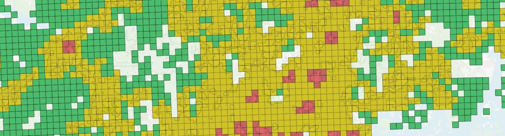

# Ensihoitopalvelun riskialuejako



Tämä ohjelmakoodi muodostaa THL:n ensihoitopalvelun rekisterissä käytettävän riskialueaineiston Tilastokeskuksen ja Suomen ympäristökeskuksen paikkatietoaineistojen perusteella. Aineiston avulla raportoidaan ensihoidon palvelutasopäätöksen toteutumista.

### Versio 2024-001

Riskialueluokkien jakauma:

| Riskiluokka     | Ruutuja (1 km x 1 km) |
| --------------- | --------------------- |
| Ydintaajama     | 366                   |
| Muu taajama     | 14022                 |
| Asuttu maaseutu | 83932                 |
| Muu alue        | 294982                |
| Yhteensä        | 393302                |

Muuttujat:

| nimi         | selite                                                                                                |
| ------------ | ----------------------------------------------------------------------------------------------------- |
| `square_id`  | Tilastoruudun identifiointitunnus, kansallinen juokseva numerointi                                    |
| `euref_x`    | Ruudun vasemman alanurkan x-koordinaatti                                                              |
| `euref_y`    | Ruudun vasemman alanurkan y-koordinaatti                                                              |
| `eh_risk_id` | Riskialueluokan kokonaislukutunniste. 1: Ydintaajama, 2: Muu taajama, 3: Asuttu maaseutu, 4: Muu alue |
| `eh_risk`    | Riskialueluokka tekstinä                                                                              |
| `population` | Tilastoruudun asukasluku                                                                              |
| `men`        | Miespuolisten asukkaiden lukumäärä. -1: tieto puuttuu.                                                |
| `women`      | Naispuolisten asukkaiden lukumäärä. -1: tieto puuttuu.                                                |
| `age_0_14`   | 0-14-vuotiaiden asukkaiden lukumäärä. -1: tieto puuttuu.                                              |
| `age_15_64`  | 15-64-vuotiaiden asukkaiden lukumäärä. -1: tieto puuttuu.                                             |
| `age_65_`    | Yli 65-vuotiaiden asukkaiden lukumäärä. -1: tieto puuttuu.                                            |

### Lähtöaineistot

Aineiston muodostamisessa käytetään seuraavia lähtöaineistoja:

- Tilastokeskuksen 1 km x 1 km väestöruutuaineisto (`vaki2022_1km.zip`), joka sisältää väestötiedot ruuduittain.
- Suomen ympäristökeskuksen 250 m x 250 m Taajamat-aineisto (`YKRTaajamat2022.zip`), joka määrittelee taajama-alueet.
- Suomen ympäristökeskuksen 250 m x 250 m Keskusta-alueet -aineisto (`KeskustaAlueet2021.zip`), joka sisältää tiedot kaupunkien keskusta-alueista ja niiden tyypeistä.

### Riskialueluokat

Riskialueluokat määräytyvät seuraavasti:

1. __Ydintaajama__ kun Keskusta-alueet -aineiston _Kaupunkiseudun keskusta_- tai _Kaupunkiseudun iso alakeskus_ -tyyppinen alue ulottuu tilastoruutuun.
2. __Muu taajama__ kun Taajamat-aineiston taajama-alue ulottuu tilastoruutuun, eikä ruutua luokiteltu ydintaajamaksi kohdassa 1.
3. __Asuttu maaseutu__ -luokka asetetaan lopuille asutuille tilastoruuduille.
4. Asuttujen väestöruutujen, taajamien ja keskustojen ulkopuolelle jäävä alue kuuluu luokkaan __Muu alue__.

### Prosessin kuvaus

1. Ladataan ja yhdistetään väestöruutuaineisto ja lähtöaineistot `geopandas`-kirjaston avulla.
2. Alustetaan jokaiselle ruudulle oletusarvoisesti riskiluokka "Muu alue".
3. Määritellään kullekin ruudulle riskiluokka perustuen lähtöaineistojen spatiaaliseen analyysiin:
   - Keskusta-alueiden ja Taajama-aineistojen perusteella tunnistetaan "Ydintaajama" ja "Muu taajama" luokat.
   - Väestötietojen avulla tunnistetaan "Asuttu maaseutu" luokat.
   - Väestötietoaineisto liitetään tilastoruudukkoon ruudun id-numeron perusteella.
   - 250 metrin ruudukkoaineistojen liittämisessä 1000 m tilastoruudukkoon käytetään predikaattia (_overlaps_ TAI _contains_ TAI _within_), jolloin saavutetaan visuaalisesti tarkasteltuna haluttu lopputulos.
4. Täydennetään aineisto väestötiedoilla ja muodostetaan lopulliset riskialueaineistot asutuille ruuduille.
5. Tallennetaan lopputulokset shapefile-muodossa.

### Lopputuloksen hyödyntäminen

Valmiit aineistot mahdollistavat ensihoitopalveluiden suunnittelun ja resurssien kohdentamisen riskiperusteisesti. Aineistojen avulla voidaan tunnistaa alueet, joilla on suurin tarve ensihoitopalveluille väestötiheyden ja alueen riskiluokituksen perusteella.

### Tiedostot

| Tiedostonimi   | Kuvaus |
| -------------- | ------ |
| `generate.py`  | Aineiston muodostava ohjelmakoodi |
| `qgis-riskialueet.qgz` | QGIS-projekti visuaalista tarkastelua varten |
| `input/hila1km.zip` | Shapefile: 1 km x 1 km tilastoruudukko |
| `input/vaki2022_1km` | Tilastokeskuksen väestöruutuaineisto 1 km x 1 km |
| `YKRTaajamat2022.zip` | SYKE:n YKR Taajamat-aineisto 250 m x 250 m |
| `KeskustaAlueet2021.zip` | SYKE:n Keskusta-alueet -aineisto 250 m x 250 m |

### Koodin suorittaminen

Virtuaaliympäristön luonti ja aktivointi:

```
python -m venv .venv
./.venv/Scripts/activate
```

Tarvittavien kirjastojen asennus:

```
pip install .
```

Paikkatietoaineiston muodostaminen:

```
python generate.py
```

## Lähteet

Lasse Ilkka, Jouni Kurola, Jukka Pappinen. [Ohje ensihoitopalvelun palvelutasopäätöksen laatimiseksi](http://urn.fi/URN:ISBN:978-952-00-3967-7), Sosiaali- ja terveysministeriö 2017.

[Väestöruutuaineisto 1 km x 1 km](https://www.stat.fi/org/avoindata/paikkatietoaineistot/vaestoruutuaineisto_1km.html), Tilastokeskus. Aineisto on ladattu Tilastokeskuksen [rajapintapalvelusta](https://geo.stat.fi/geoserver/vaestoruutu/wfs) 19.2.2024 lisenssillä [CC BY 4.0](https://creativecommons.org/licenses/by/4.0/deed.fi).

[Keskusta-alueet 2021](https://metadata.ymparisto.fi/dataset/%7B79B6DD92-3448-402D-95A9-D56B484CD6A1%7D), Suomen ympäristökeskus. Aineisto on ladattu Suomen ympäristökeskuksen [latauspalvelusta](https://wwwd3.ymparisto.fi/d3/gis_data/spesific/KeskustaAlueet2021.zip) 19.2.2024 lisenssillä [CC BY 4.0](https://creativecommons.org/licenses/by/4.0/deed.fi).

[Taajamat 2022 (YKR)](https://metadata.ymparisto.fi/dataset/%7B28F79998-B5E2-4085-AF80-FB3FA5E9F9BA%7D), Suomen ympäristökeskus. Aineisto on ladattu Suomen ympäristökeskuksen [latauspalvelusta](https://wwwd3.ymparisto.fi/d3/gis_data/spesific/YKRTaajamat2022.zip) 19.2.2024 lisenssillä [CC BY 4.0](https://creativecommons.org/licenses/by/4.0/deed.fi).

## Lisenssi

Tämä sisältö noudattaa Creative Commons Nimeä 4.0 ([CC BY 4.0](https://creativecommons.org/licenses/by/4.0/deed.fi)) -lisenssiä. Terveyden ja hyvinvoinnin laitos.
